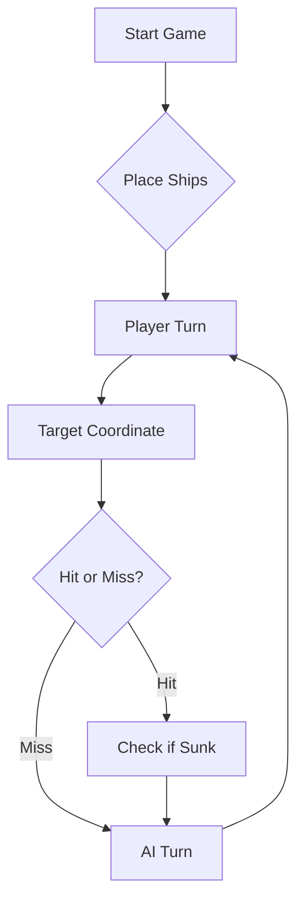

# ⚓ Battleship 2.0

## See the information in html

To see the information in html, just search [https://lei-129897.github.io/Battleship2/docs/index.html](https://lei-129897.github.io/Battleship2/) in the search bar (or just add /docs/index.html to the current domain)


> A modern take on the classic naval warfare game, designed for the XVII century setting with updated software engineering patterns.

---

## 📖 Table of Contents
- [Project Overview](#-project-overview)
- [Key Features](#-key-features)
- [Technical Stack](#-technical-stack)
- [Installation & Setup](#-installation--setup)
- [Code Architecture](#-code-architecture)
- [Roadmap](#-roadmap)
- [Contributing](#-contributing)

---

## 🎯 Project Overview
This project serves as a template and reference for students learning **Object-Oriented Programming (OOP)** and **Software Quality**. It simulates a battleship environment where players must strategically place ships and sink the enemy fleet.

### 🎮 The Rules
The game is played on a grid (typically 10x10). The coordinate system is defined as:

$$(x, y) \in \{0, \dots, 9\} \times \{0, \dots, 9\}$$

Hits are calculated based on the intersection of the shot vector and the ship's bounding box.

---

## ✨ Key Features
| Feature | Description | Status |
| :--- | :--- | :---: |
| **Grid System** | Flexible $N \times N$ board generation. | ✅ |
| **Ship Varieties** | Galleons, Frigates, and Brigantines (XVII Century theme). | ✅ |
| **AI Opponent** | Heuristic-based targeting system. | 🚧 |
| **Network Play** | Socket-based multiplayer. | ❌ |

---

## 🛠 Technical Stack
* **Language:** Java 17
* **Build Tool:** Maven / Gradle
* **Testing:** JUnit 5
* **Logging:** Log4j2

---

## 🚀 Installation & Setup

### Prerequisites
* JDK 17 or higher
* Git

### Step-by-Step
1. **Clone the repository:**
   ```bash
   git clone [https://github.com/britoeabreu/Battleship2.git](https://github.com/britoeabreu/Battleship2.git)
   ```
2. **Navigate to directory:**
   ```bash
   cd Battleship2
   ```
3. **Compile and Run:**
   ```bash
   javac Main.java && java Main
   ```

---

## 📚 Documentation

You can access the generated Javadoc here:

👉 [Battleship2 API Documentation](https://britoeabreu.github.io/Battleship2/)


### Core Logic
```java
public class Ship {
    private String name;
    private int size;
    private boolean isSunk;

    // TODO: Implement damage logic
    public void hit() {
        // Implementation here
    }
}
```

### Design Patterns Used:
- **Strategy Pattern:** For different AI difficulty levels.
- **Observer Pattern:** To update the UI when a ship is hit.
</details>

### Logic Flow


---

## 🗺 Roadmap
- [x] Basic grid implementation
- [x] Ship placement validation
- [ ] Add sound effects (SFX)
- [ ] Implement "Fog of War" mechanic
- [ ] **Multiplayer Integration** (High Priority)

---

## 🧪 Testing
We use high-coverage unit testing to ensure game stability. Run tests using:
```bash
mvn test
```

> [!TIP]
> Use the `-Dtest=ClassName` flag to run specific test suites during development.

### Tempo por jogada (consola)

A [Issue #3](https://github.com/LEI-129897/Battleship2/issues/3), etiquetada
`type: ENHANCEMENT`, é implementada no ramo `124790`.
A dependência foi adicionada primeiro ao `pom.xml`: o GAV
`org.apache.commons:commons-lang3:3.20.0`, disponível no
[Maven Central](https://central.sonatype.com/artifact/org.apache.commons/commons-lang3/3.20.0).
A medição utiliza o [StopWatch da Apache Commons Lang](https://commons.apache.org/proper/commons-lang/apidocs/org/apache/commons/lang3/time/StopWatch.html).

Depois de `gerafrota` ou `lefrota`, o cronómetro começa antes do próximo prompt.
Termina assim que a linha da `rajada` é lida, antes do processamento dos tiros.
Após cada rajada, a consola apresenta, por exemplo:

```text
Tempo da jogada nº1: 2.347 segundos.
```

Cada jogada tem um novo cronómetro, iniciado depois de apresentar os resultados
da anterior. Os comandos `ajuda`, `estado`, `mapa` e `tiros` mantêm a medição em
curso; carregar outra frota inicia uma nova partida e uma nova medição.
O comando `simula` continua a executar jogadas automáticas, sem medir decisões
do jogador.

Para executar a versão de consola (o manifesto do JAR inicia o servidor REST):

```bash
mvn package
java -cp target/BattleshipGamePlayer-2.0.jar battleship.Main
```

---

## 🤝 Contributing
Contributions are what make the open-source community such an amazing place to learn, inspire, and create.

1. Fork the Project
2. Create your Feature Branch (`git checkout -b feature/AmazingFeature`)
3. Commit your Changes (`git commit -m 'Add some AmazingFeature'`)
4. Push to the Branch (`git push origin feature/AmazingFeature`)
5. Open a **Pull Request**

---

## 📄 License
Distributed under the MIT License. See `LICENSE` for more information.

---
**Maintained by:** [@britoeabreu](https://github.com/britoeabreu)  
*Created for the Software Engineering students at ISCTE-IUL.*
